本文非原创，原文出处[int32bit](https://github.com/int32bit/dotfiles).

### [ag](https://github.com/ggreer/the_silver_searcher)

比grep、ack更快地递归搜索文件内容。

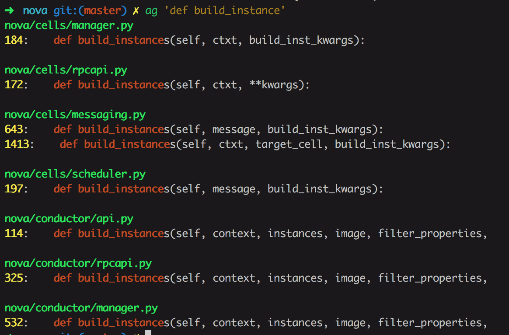

### [tig](https://github.com/jonas/tig)

字符模式下交互查看git项目。
 


### [mycli](https://github.com/dbcli/mycli)

mysql客户端，支持语法高亮和命令补全，效果类似ipython，可以替代mysql命令，效果如图:

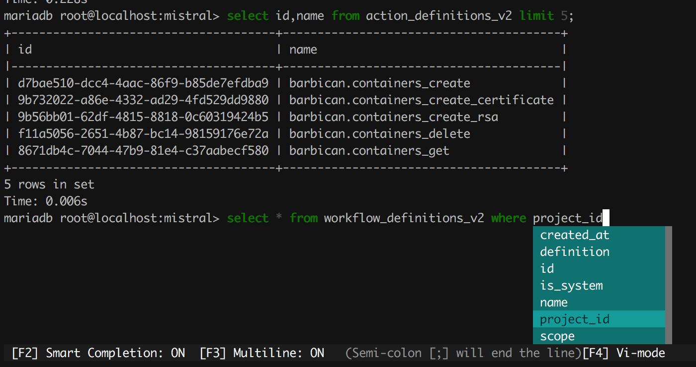

### [jq](https://github.com/stedolan/jq)

json文件格式化处理以及高亮显示，可以替换`python -m json.tool`, 比如有以下json数据:

```json
{"migration_status": null, "attachments": [{"server_id": "80380c28-c765-448a-aa9a-c9bd5b10d64c", "attachment_id": "ba0d25c9-1066-4c49-9f05-3096d2596a44", "attached_at": "2017-03-28T02:56:24.000000", "host_name": null, "volume_id": "8cbea52c-be0d-4bf1-86f8-890b538d0771", "device": "/dev/vdb", "id": "8cbea52c-be0d-4bf1-86f8-890b538d0771"}], "links": [{"href": "http://192.168.0.156:8776/v2/abca38105b4345acbaad30d7fbf59e7d/volumes/8cbea52c-be0d-4bf1-86f8-890b538d0771", "rel": "self"}, {"href": "http://192.168.0.156:8776/abca38105b4345acbaad30d7fbf59e7d/volumes/8cbea52c-be0d-4bf1-86f8-890b538d0771", "rel": "bookmark"}], "availability_zone": "nova", "os-vol-host-attr:host": "cinder@ssd-ceph#ssd-ceph", "encrypted": false, "updated_at": "2017-03-28T02:56:24.000000", "replication_status": "disabled", "snapshot_id": null, "id": "8cbea52c-be0d-4bf1-86f8-890b538d0771", "size": 100, "user_id": "33ec3ec44f5440bca7760771b1f20ea6", "os-vol-tenant-attr:tenant_id": "abca38105b4345acbaad30d7fbf59e7d", "os-vol-mig-status-attr:migstat": null, "metadata": {"readonly": "False", "attached_mode": "rw"}, "status": "in-use", "volume_image_metadata": {}, "description": null, "multiattach": false, "source_volid": null, "consistencygroup_id": null, "os-vol-mig-status-attr:name_id": null, "name": "swift-1", "bootable": "false", "created_at": "2017-03-28T02:43:57.000000", "volume_type": null}
```

使用jq格式化输出如图:

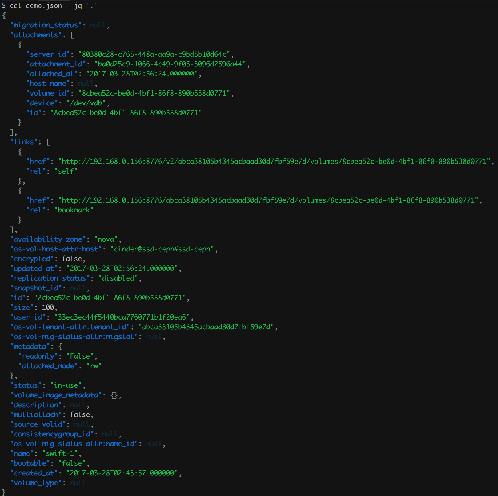

使用jq还可以应用各种filter，从而只输出我们感兴趣的字段:

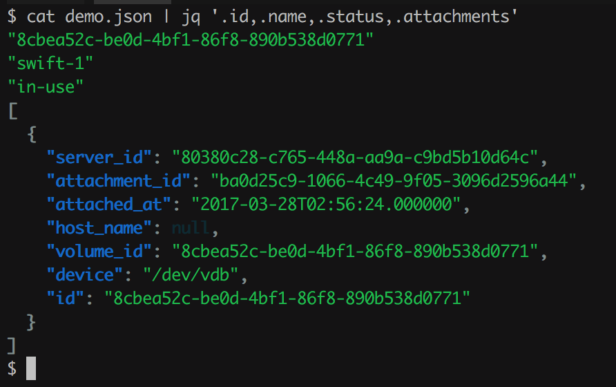

### [shellcheck](https://github.com/koalaman/shellcheck)

shell脚本静态检查工具，能够识别语法错误以及不规范的写法。

比如有以下shell脚本`test.sh`:

```sh
#!/bin/bash
a=1
b=2
for i in $@; do
    echo $i
done
echo $a
```

使用shellcheck检查结果如下:

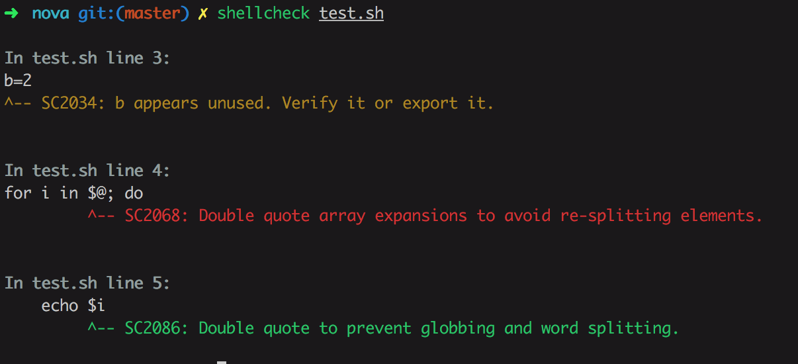

### [yapf](https://github.com/google/yapf)

Google开发的python代码格式规范化工具，支持pep8以及Google代码风格。

```sh
yapf -i --style pep8 --recursive src/
```

### [mosh](https://mosh.org/#getting)

可以替代ssh，连接更稳定，即使IP变了，也能自动重连。

### [fzf](https://github.com/junegunn/fzf)

命令行下模糊搜索工具，能够交互式智能搜索并选取文件或者内容。

```sh
fzf
```

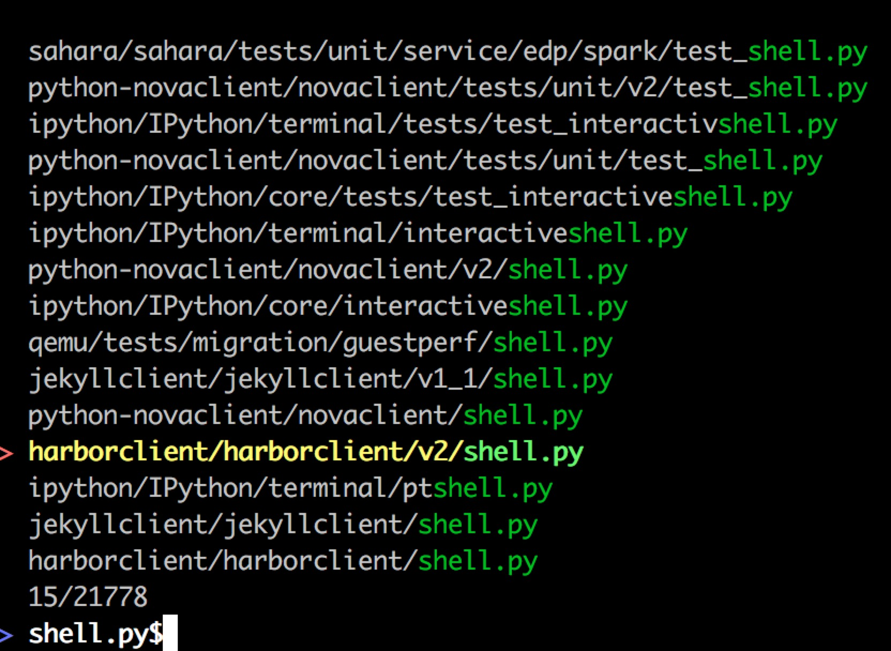

该命令还有一个最经典的应用是历史命令搜索，按下CTRL-R，结果如下:

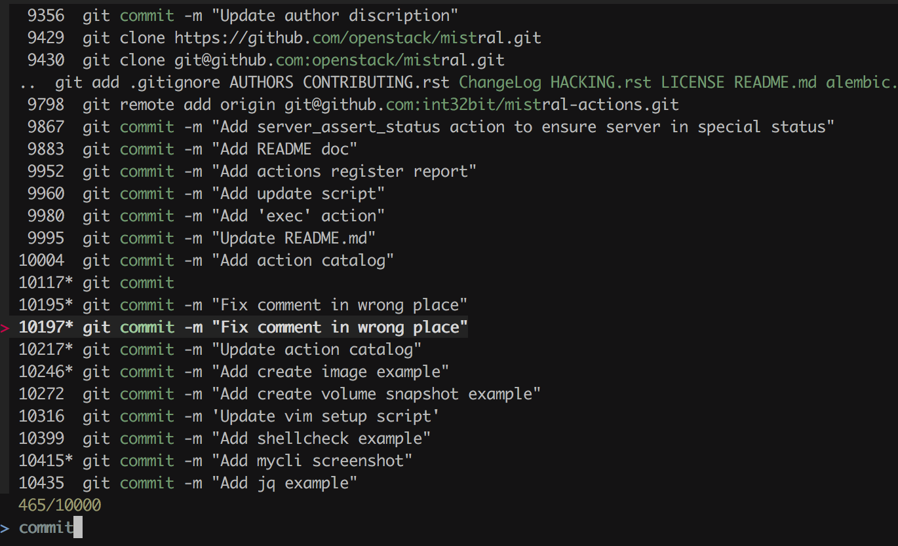

### [PathPicker(fpp)](https://github.com/facebook/PathPicker)

在命令行输出中自动识别目录和文件，交互式选择后使用EDTOR打开.

```
git diff HEAD~8 --stat
```

输出如下:

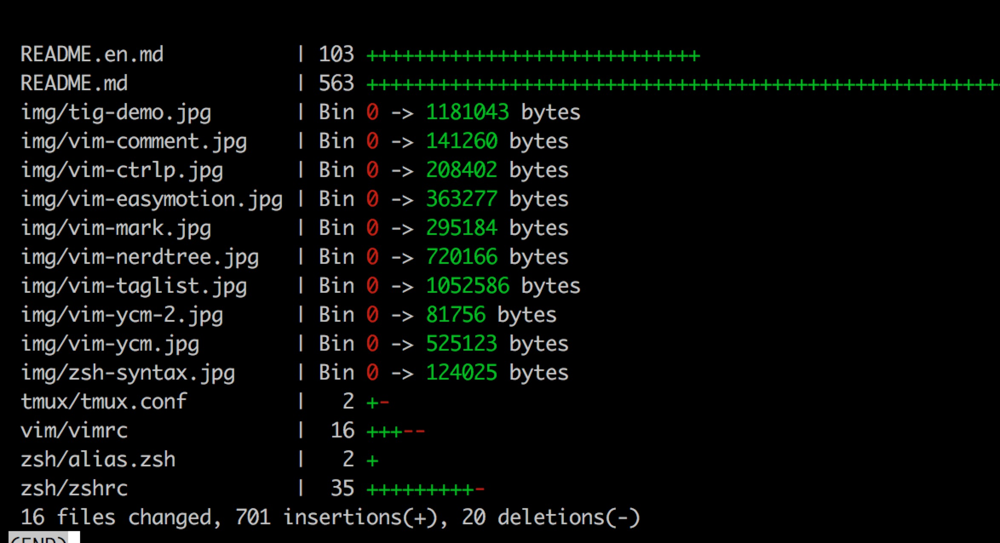

```
git diff HEAD~8 --stat | fpp
```

可以光标选择文件打开或者执行命令:

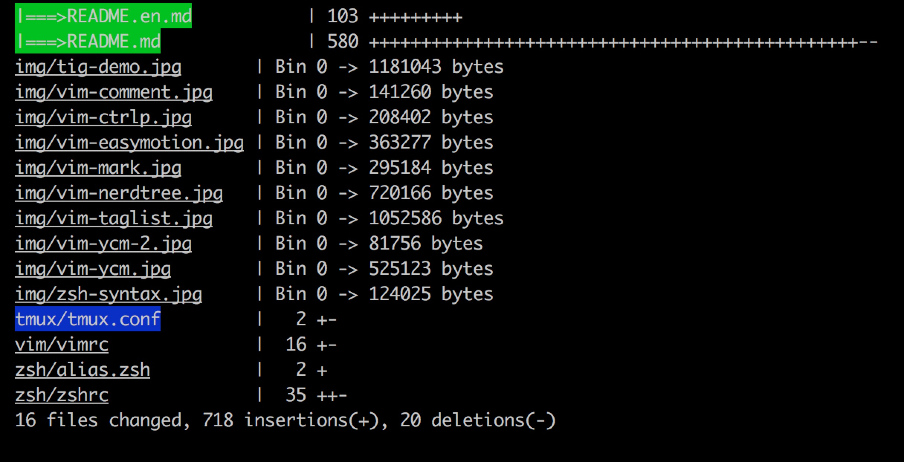

绿色显示的表示我们选中的文件，此时输入enter键将调用编辑器打开选中的文件，也可以按c进入命令模式，可以输入执行的命令，选中的文件将作为命令的输入文件。

### [pandoc](http://pandoc.org/)

Markdown，HTML，PDF，LaTEX等文档格式之间的命令行转换工具。

支持PDF转化需要依赖pdflatex:

```
brew cask install mactex
```

把`README.md`转化为PDF格式:

```bash
pandoc -f markdown_github -t latex -o README.pdf README.md
```

### [htop](https://hisham.hm/htop/)
 
可以代替top命令，提供更美观、更方便的进程监控工具。

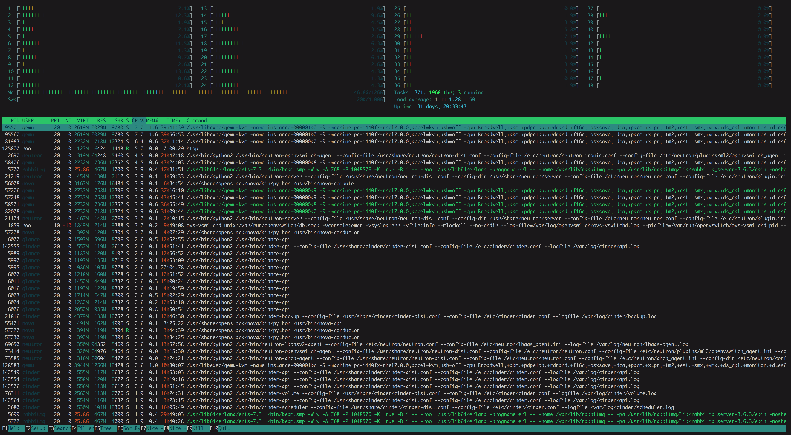

### [axel](http://axel.alioth.debian.org/)

多线程下载工具，下载大文件时可以替代curl、wget。

```sh
axel -n 20 http://centos.ustc.edu.cn/centos/7/isos/x86_64/CentOS-7-x86_64-Minimal-1511.iso
```

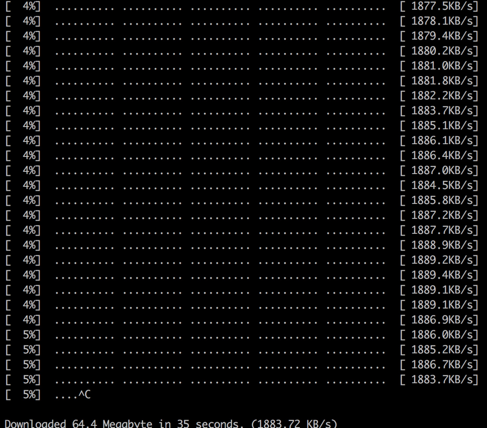

yum、gentoo partage等包管理工具能配置axel为下载工具替代curl。

CentOS系统需要安装[yum-axelget](https://github.com/crook/yum-axelget)插件，安装和配置过程如下:

```sh
yum install axel yum-plugin-fastestmirror yum-axelget
```

修改`/etc/yum/pluginconf.d/axelget.conf`配置文件，根据需求调整`maxconn`值。

Homebrew从2013年开始提出使用axel作为下载工具，但目前好像尚未实现，参考[#19802](https://github.com/Homebrew/legacy-homebrew/issues/19802)。

### [sz/rz](https://github.com/mmastrac/iterm2-zmodem)

ssh登录到服务器后经常需要传输文件, 通常我们会使用scp/rsync工具，或者使用ftp/nc等命令，临时解决办法还可以使用`python -m SimpleHTTPServer`或者`python3 -m http.server`开启HTTP服务器使用浏览器下载。

sz/rz能够提供更简单的交互式接口快速地和本地主机进行文件传输,也就是上传和下载文件到服务器和本地。

运行:

```
sz  a.txt b.txt c.txt
```
会立即弹出本地文件管理窗口选择保存位置，不需要输入密码。

同样地，运行:

```
rz
```

会弹出本地文件管理工具，选择需要传输的文件，能够快速传输到当前服务器工作目录下。

**注意:**

* sz/rz目前不支持tmux(加上`-e`参数也无效), 因此不能在tmux session下执行rz/sz,否则会hang住。
* Windows下使用xshell登录服务器，只需要在远程服务器安装lrzsz包即可，不需要在本地windows做任何配置。
* 在Mac下，本地和远程服务器都需要安装lrzsz包，并且iterm2需要配置，参考[ZModem integration for iTerm 2](https://github.com/mmastrac/iterm2-zmodem)

### [cloc](http://cloc.sourceforge.net/)

cloc是代码统计工具，能够统计代码的空行数、注释行、编程语言等，如图:

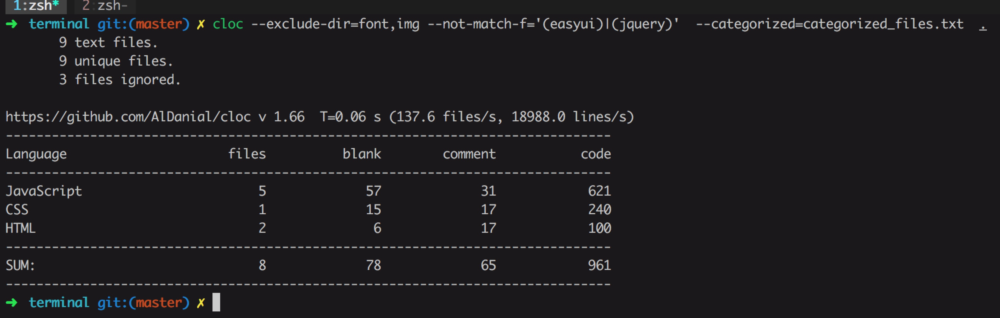

### [you-get](https://you-get.org/)

从网页中自动捕捉视频、音频、图片并下载到本地，支持youtube、google+、优酷、芒果TV、腾讯视频、秒拍等。

```
$ you-get 'https://www.youtube.com/watch?v=jNQXAC9IVRw'
site:                YouTube
title:               Me at the zoo
stream:
    - itag:          43
      container:     webm
      quality:       medium
      size:          0.5 MiB (564215 bytes)
    # download-with: you-get --itag=43 [URL]

Downloading zoo.webm ...
100.0% (  0.5/0.5  MB) ├████████████████████████████████████████┤[1/1]    7 MB/s

Saving Me at the zoo.en.srt ...Done.
```