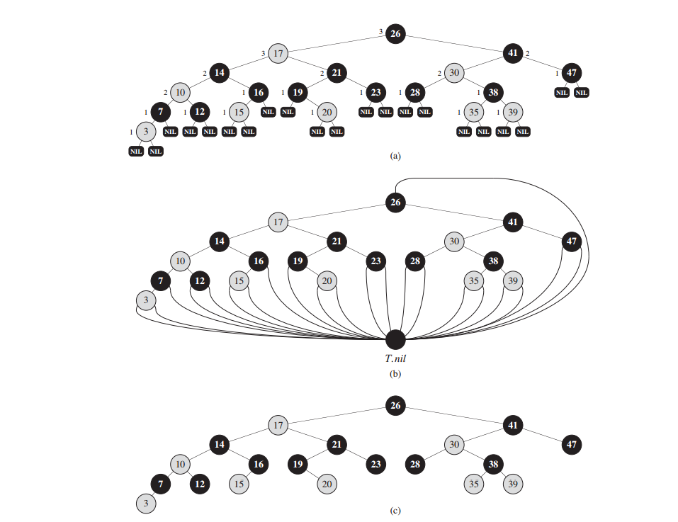
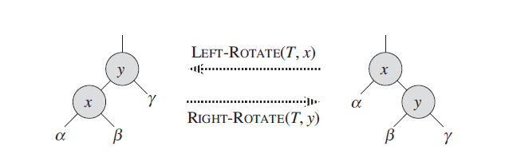

# Properties of red-black trees

A red-black tree is a binary search tree with one extra bit of storage per node: its
color, which can be either RED or BLACK. By constraining the node colors on any
simple path from the root to a leaf, red-black trees ensure that no such path is more
than twice as long as any other, so that the tree is approximately balanced.

Each node of the tree now contains the attributes color, key, left, right, and p. If
a child or the parent of a node does not exist, the corresponding pointer attribute
of the node contains the value NIL. We shall regard these NILs as being pointers to
leaves (external nodes) of the binary search tree and the normal, key-bearing nodes
as being internal nodes of the tree.

A red-black tree is a binary tree that satisfies the following red-black properties:

1. Every node is either red or black.
2. The root is black.
3. Every leaf (NIL) is black.
4. If a node is red, then both its children are black.
5. For each node, all simple paths from the node to descendant leaves contain the
same number of black nodes.

As a matter of convenience in dealing with boundary conditions in red-black
tree code, we use a single sentinel to represent NIL. For a red-black tree T , the
sentinel T:nil is an object with the same attributes as an ordinary node in the tree.
Its color attribute is BLACK, and its other attributes—p, left, right, and key—can
take on arbitrary values.

We use the sentinel so that we can treat a NIL child of a node x as an ordinary
node whose parent is x. Although we instead could add a distinct sentinel node
for each NIL in the tree, so that the parent of each NIL is well defined, that approach
would waste space. Instead, we use the one sentinel T:nil to represent all
the NILs—all leaves and the root’s parent. The values of the attributes p, left, right,
and key of the sentinel are immaterial, although we may set them during the course
of a procedure for our convenience.

We generally confine our interest to the internal nodes of a red-black tree, since
they hold the key values. In the remainder of this chapter, we omit the leaves when
we draw red-black trees.

We call the number of black nodes on any simple path from, but not including, a
node x down to a leaf the black-height of the node, denoted bh(x). By property 5,
the notion of black-height is well defined, since all descending simple paths from
the node have the same number of black nodes. We define the black-height of a
red-black tree to be the black-height of its root.

<figure>
	
	<figcaption>Figure 1 red-black tree.</figcaption>
</figure>

# Rotations

Because they modify the tree, the result may violate the red-black properties. To
restore these properties, we must change the **colors of some of the nodes in the
tree** and also **change the pointer structure**.

We change the pointer structure through rotation, which is a local operation in
a search tree that preserves the binary-search-tree property. Figure 2 shows the
two kinds of rotations: **left rotations** and **right rotations**. When we do a left rotation
on a node x, we assume that its right child y is not T:nil; x may be any node in
the tree whose right child is not T:nil. The left rotation “pivots” around the link
from x to y. It makes y the new root of the subtree, with x as y’s left child and y’s
left child as x’s right child.

<figure>
	
	<figcaption>Figure 2 rotation.</figcaption>
</figure>