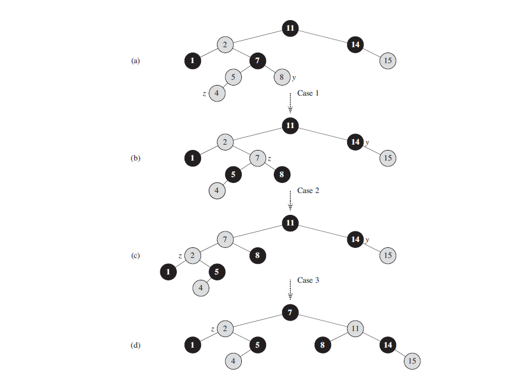
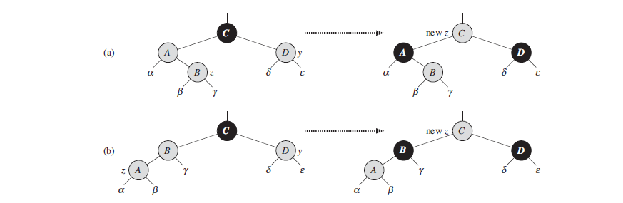

# Insertion

```
RB-INSERT(T, z)
1 y = T.nil
2 x = T.root
3 while x != T.nil
4   y = x
5   if z.key < x.key
6       x = x.left
7   else x = x.right
8   z.p = y
9   if y == T.nil
10      T.root = z
11  elseif z.key < y.key
12      y.left = z
13  else y.right = z
14 z.left = T.nil
15 z.right = T.nil
16 z.color = RED
17 RB-INSERT-FIXUP(T, z)
```

We can insert a node into an n-node red-black tree in O(lg n) time. To do so, we
insert node z into the tree T as if it were an ordinary binary search tree, and then we
color z red. To guarantee that the red-black properties are preserved, we then call an
auxiliary procedure `RB-INSERT-FIXUP` to recolor nodes and perform rotations.

```
RB-INSERT-FIXUP(T, z)
1 while z.p.color == RED
2   if z.p == z.p.p.left
3       y = z.p.p.right
4       if y.color == RED
5           z.p.color = BLACK       // case 1
6           y.color = BLACK         // case 1
7           z.p.p.color = RED       // case 1
8           z = z.p.p               // case 1
9       else if z == z.p.right
10               z = z.p            // case 2
11               LEFT-ROTATE(T, z)  // case 2
12          z.p.color = BLACK       // case 3
13          z.p.p.color = RED       // case 3
14          RIGHT-ROTATE(T, z.p.p)  // case 3
15  else (same as then clause
            with “right” and “left” exchanged)
16 T.root.color = BLACK
```

<figure>
	
	<figcaption>Figure 1 The operation of RB-INSERT-FIXUP.</figcaption>
</figure>

To understand how `RB-INSERT-FIXUP` works, we shall break our examination
of the code into three major steps. 

- First, we shall determine what violations of
the red-black properties are introduced in `RB-INSERT` when node z is inserted
and colored red.
- Second, we shall examine the overall goal of the while loop in
lines 1–15.
- Finally, we shall explore each of the three cases within the while
loop’s body and see how they accomplish the goal.

Which of the red-black properties might be violated upon the call to `RBINSERT-FIXUP`?
Property 1 certainly continues to hold, as does property 3, since both children of the
newly inserted red node are the sentinel T.nil. Property 5, which says that the number
of black nodes is the same on every simple path from a given node, is satisfied as well,
because node z replaces the (black) sentinel, and node z is red with sentinel children.
**Thus, the only properties that might be violated are property 2, which requires the
root to be black, and property 4, which says that a red node cannot have a red child.**
Both possible violations are due to z being colored red. Property 2 is violated if z is
the root, and property 4 is violated if z’s parent is red.

The while loop in lines 1–15 maintains the following three-part invariant at the
start of each iteration of the loop:

1. Node z is red.
2. If z.p is the root, then z.p is black.
3. If the tree violates any of the red-black properties, then it violates at most
one of them, and the violation is of either property 2 or property 4. If the
tree violates property 2, it is because z is the root and is red. If the tree
violates property 4, it is because both z and z.p are red.

**Initialization**: Prior to the first iteration of the loop, we started with a
red-black tree with no violations, and we added a red node z. We show that each part of
the invariant holds at the time `RB-INSERT-FIXUP` is called:

1. When `RB-INSERT-FIXUP` is called, z is the red node that was added.
2. If z.p is the root, then z.p started out black and did not change prior to the
   call of RB-INSERT-FIXUP.
3. We have already seen that properties 1, 3, and 5 hold when RB-INSERTFIXUP
   is called.

   If the tree violates property 2, then the red root must be the newly added
   node z, which is the only internal node in the tree. Because the parent and
   both children of z are the sentinel, which is black, the tree does not also
   violate property 4. Thus, this violation of property 2 is the only violation of
   red-black properties in the entire tree.

   If the tree violates property 4, then, because the children of node z are black
   sentinels and the tree had no other violations prior to z being added, the violation
   must be because both z and z.p are red. Moreover, the tree violates no other red-black
   properties.

**Termination**: When the loop terminates, it does so because z.p is black. (If z is
the root, then z.p is the sentinel T.nil, which is black.) Thus, the tree does not
violate property 4 at loop termination. By the loop invariant, the only property
that might fail to hold is property 2. Line 16 restores this property, too, so that
when `RB-INSERT-FIXUP` terminates, all the red-black properties hold.

**Maintenance**: We actually need to consider six cases in the while loop, but three
of them are symmetric to the other three, depending on whether line 2 determines
z’s parent z.p to be a left child or a right child of z’s grandparent z.p.p.
We have given the code only for the situation in which z.p is a left child. The
node z.p.p exists, since by part (2) of the loop invariant, if z.p is the root,
then z.p is black. Since we enter a loop iteration only if z.p is red, we know
that z.p cannot be the root. Hence, z.p.p exists.

We distinguish case 1 from cases 2 and 3 by the color of z’s parent’s sibling,
or “uncle.” Line 3 makes y point to z’s uncle z.p.p.right, and line 4 tests y’s
color. If y is red, then we execute case 1. Otherwise, control passes to cases 2
and 3. In all three cases, z’s grandparent z.p.p is black, since its parent z.p is
red, and property 4 is violated only between z and z.p.

*Case 1: z’s uncle y is red*

Figure 2 shows the situation for case 1 (lines 5–8), which occurs when
both z.p and y are red. Because z.p.p is black, we can color both z.p and y
black, thereby fixing the problem of z and z.p both being red, and we can
color z.p.p red, thereby maintaining property 5. We then repeat the while loop
with z.p.p as the new node z. The pointer z moves up two levels in the tree.
Now, we show that case 1 maintains the loop invariant at the start of the next
iteration. We use z to denote node z in the current iteration, and z’ = z.p.p
to denote the node that will be called node z at the test in line 1 upon the next
iteration.

1. Because this iteration colors z.p.p red, node z’ is red at the start of the next
iteration.
2. The node z’p is z.p.p.p in this iteration, and the color of this node does not
change. If this node is the root, it was black prior to this iteration, and it
remains black at the start of the next iteration.
3. We have already argued that case 1 maintains property 5, and it does not
introduce a violation of properties 1 or 3.

<figure>
	
	<figcaption>Figure 2 Case 1 of the procedure RB-INSERT-FIXUP.</figcaption>
</figure>

If node z’ is the root at the start of the next iteration, then case 1 corrected
the lone violation of property 4 in this iteration. Since z’ is red and it is the
root, property 2 becomes the only one that is violated, and this violation is
due to z’.
If node z’ is not the root at the start of the next iteration, then case 1 has
not created a violation of property 2. Case 1 corrected the lone violation
of property 4 that existed at the start of this iteration. It then made z’ red
and left z’.p alone. If z’.p was black, there is no violation of property 4.
If z’.p was red, coloring z’ red created one violation of property 4 between z’
and z’.p.

*Case 2: z’s uncle y is black and z is a right child*  
*Case 3: z’s uncle y is black and z is a left child*

In cases 2 and 3, the color of z’s uncle y is black. We distinguish the two cases
according to whether z is a right or left child of z.p. Lines 10–11 constitute
case 2, which is shown in Figure 13.6 together with case 3. In case 2, node z
is a right child of its parent. We immediately use a left rotation to transform
the situation into case 3 (lines 12–14), in which node z is a left child. Because
both z and z.p are red, the rotation affects neither the black-height of nodes
nor property 5. Whether we enter case 3 directly or through case 2, z’s uncle y
is black, since otherwise we would have executed case 1. Additionally, the
node z.p.p exists, since we have argued that this node existed at the time that
lines 2 and 3 were executed, and after moving z up one level in line 10 and then
down one level in line 11, the identity of z.p.p remains unchanged. In case 3,
we execute some color changes and a right rotation, which preserve property 5,
and then, since we no longer have two red nodes in a row, we are done. The
**while** loop does not iterate another time, since z.p is now black.
We now show that cases 2 and 3 maintain the loop invariant. (As we have just
argued, z.p will be black upon the next test in line 1, and the loop body will not
execute again.)

<figure>
	
	<figcaption>Figure 3 Cases 2 and 3 of the procedure RB-INSERT-FIXUP.</figcaption>
</figure>

1. Case 2 makes z point to z.p, which is red. No further change to z or its color
occurs in cases 2 and 3.
2. Case 3 makes z.p black, so that if z.p is the root at the start of the next
iteration, it is black.
3. As in case 1, properties 1, 3, and 5 are maintained in cases 2 and 3.
Since node z is not the root in cases 2 and 3, we know that there is no violation
of property 2. Cases 2 and 3 do not introduce a violation of property 2,
since the only node that is made red becomes a child of a black node by the
rotation in case 3.
Cases 2 and 3 correct the lone violation of property 4, and they do not introduce
another violation.

Having shown that each iteration of the loop maintains the invariant, we have
shown that `RB-INSERT-FIXUP` correctly restores the red-black properties.

**Analysis**

What is the running time of `RB-INSERT`? Since the height of a red-black tree on n
nodes is O(lg n), lines 1–16 of `RB-INSERT` take O(lg n) time. In `RB-INSERTFIXUP`,
the while loop repeats only if case 1 occurs, and then the pointer z moves
two levels up the tree. The total number of times the while loop can be executed
is therefore O(lg n). Thus, `RB-INSERT` takes a total of O(lg n) time. Moreover, it
never performs more than two rotations, since the while loop terminates if case 2
or case 3 is executed.