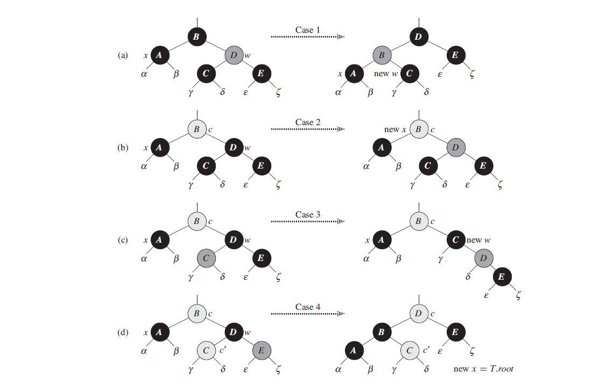

# Deletion

## RB-DELETE

Like the other basic operations on an n-node red-black tree, deletion of a node takes
time O(lg n).

```
RB-TRANSPLANT(T, u, v)
1 if u.p == T.nil
2     T.root = v
3 elseif u == u.p.left
4     u.p.left = v
5 else u.p.right = v
6 v.p = u.p
```

When we want to delete node z and z has fewer than two children, then z is removed from the tree, and we
want y to be z. When z has two children, then y should be z´s successor, and y
moves into z’s position in the tree. We also remember y’s color before it is removed
from or moved within the tree, and we keep track of the node x that moves
into y’s original position in the tree, because node x might also cause violations
of the red-black properties. After deleting node z, `RB-DELETE` calls an auxiliary
procedure `RB-DELETE-FIXUP`, which changes colors and performs rotations to
restore the red-black properties.

```
RB-DELETE(T, z)
1 y = z
2 y-original-color = y.color
3 if z.left == T.nil
4     x = z.right
5     RB-TRANSPLANT(T, z, z.right)
6 elseif z.right == T.nil
7     x = z.left
8     RB-TRANSPLANT(T, z, z.left)
9 else y = TREE-MINIMUM(z.right)
10     y-original-color = y.color
11     x = y.right
12     if y.p == z
13         x.p = y
14     else RB-TRANSPLANT(T, y, y.right)
15         y.right = z.right
16         y.right.p = y
17     RB-TRANSPLANT(T, z, y)
18     y.left = z.left
19     y.left.p = y
20     y.color = z.color
21 if y-original-color == BLACK
22     RB-DELETE-FIXUP(T, x)
```

- We maintain node y as the node either removed from the tree or moved within
  the tree. Line 1 sets y to point to node z when z has fewer than two children
  and is therefore removed. When z has two children, line 9 sets y to point to z’s
  successor, and y will move into z’s position in the tree.
- Because node y’s color might change, the variable y-original-color stores y’s
  color before any changes occur. Lines 2 and 10 set this variable immediately
  after assignments to y. When z has two children, then y != z and node y
  moves into node z’s original position in the red-black tree; line 20 gives y the
  same color as z. We need to save y’s original color in order to test it at the
  end of `RB-DELETE`; if it was black, then removing or moving y could cause violations
  of the red-black properties.
- As discussed, we keep track of the node x that moves into node y’s original
  position. The assignments in lines 4, 7, and 11 set x to point to either y’s only
  child or, if y has no children, the sentinel T.nil.
- Since node x moves into node y’s original position, the attribute x.p is always
  set to point to the original position in the tree of y’s parent, even if x is, in fact,
  the sentinel T.nil. Unless z is y’s original parent (which occurs only when z has
  two children and its successor y is z’s right child), the assignment to x.p takes
  place in line 6 of `RB-TRANSPLANT`. (Observe that when `RB-TRANSPLANT` is called in
  lines 5, 8, or 14, the second parameter passed is the same as x.)

  When y’s original parent is z, however, we do not want x.p to point to y’s original
  parent, since we are removing that node from the tree. Because node y will
  move up to take z’s position in the tree, setting x.p to y in line 13 causes x.p
  to point to the original position of y’s parent, even if x == T.nil.
- Finally, if node y was black, we might have introduced one or more violations
  of the red-black properties, and so we call RB-DELETE-FIXUP in line 22 to
  restore the red-black properties. If y was red, the red-black properties still hold
  when y is removed or moved, for the following reasons:

    1. No black-heights in the tree have changed.
	  2. No red nodes have been made adjacent. Because y takes z’s place in the
       tree, along with z’s color, we cannot have two adjacent red nodes at y’s new
       position in the tree. In addition, if y was not z’s right child, then y’s original
       right child x replaces y in the tree. If y is red, then x must be black, and so
       replacing y by x cannot cause two red nodes to become adjacent.
    3. Since y could not have been the root if it was red, the root remains black.

## RB-DELETE-FIXUP

If node y was black, three problems may arise, which the call of `RB-DELETEFIXUP`
will remedy.

- First, if y had been the root and a red child of y becomes the new root, we have
  violated property 2.
- Second, if both x and x.p are red, then we have violated property 4.
- Third, moving y within the tree causes any simple path that previously contained
  y to have one fewer black node. Thus, property 5 is now violated by any ancestor
  of y in the tree. We can correct the violation of property 5 by saying that node
  x, now occupying y’s original position, has an “extra” black. That is, if we add
  1 to the count of black nodes on any simple path that contains x, then under this
  interpretation, property 5 holds. When we remove or move the black node y, we
  “push” its blackness onto node x. The problem is that now node x is neither red
  nor black, thereby violating property 1. Instead, node x is either “doubly black”
  or “red-and-black,” and it contributes either 2 or 1, respectively, to the count
  of black nodes on simple paths containing x. The color attribute of x will still
  be either RED (if x is red-and-black) or BLACK (if x is doubly black). In other
  words, the extra black on a node is reflected in x’s pointing to the node rather
  than in the `color` attribute.

```
RB-DELETE-FIXUP(T, x)
1 while x != T.root and x.color == BLACK
2     if x == x.p.left
3         w = x.p.right
4         if w.color == RED
5             w.color = BLACK                     // case 1
6             x.p.color = RED                     // case 1
7             LEFT-ROTATE(T, x.p)                 // case 1
8             w = x.p.right                       // case 1
9         if w.left.color == BLACK and w.right.color == BLACK
10            w.color = RED                       // case 2
11            x = x.p                             // case 2
12        else if w.right.color == BLACK
13            w.left.color = BLACK                // case 3
14            w.color = RED                       // case 3
15            RIGHT-ROTATE(T, w)                  // case 3
16            w = x.p.right                       // case 3
17        w.color = x.p.color                     // case 4
18        x.p.color = BLACK                       // case 4
19        w.right.color = BLACK                   // case 4
20        LEFT-ROTATE(T, x.p)                     // case 4
21        x = T.root                              // case 4
22    else (same as then clause with “right” and “left” exchanged)
23 x.color = BLACK
```

The goal of the while loop in lines 1–22 is to move the extra black up the tree until

1. x points to a red-and-black node, in which case we color x (singly) black in
   line 23;
2. x points to the root, in which case we simply “remove” the extra black; or
3. having performed suitable rotations and recolorings, we exit the loop.

Within the while loop, x always points to a nonroot doubly black node.We maintain a
pointer w to the sibling of x. Since node x is doubly black, node w cannot be T.nil,
because otherwise, the number of blacks on the simple path from x.p to the (singly
black) leaf w would be smaller than the number on the simple path from x.p to x.

*Case 1: x’s sibling w is red*

Case 1 (lines 5–8 of `RB-DELETE-FIXUP` and Figure 1(a)) occurs when node w, the sibling
of node x, is red. Since w must have black children, we can switch the colors of w and
x.p and then perform a left-rotation on x.p without violating any of the red-black
properties. The new sibling of x, which is one of w’s children prior to the rotation, is
now black, and thus we have converted case 1 into case 2, 3, or 4.  
Cases 2, 3, and 4 occur when node w is black; they are distinguished by the
colors of w’s children.

*Case 2: x’s sibling w is black, and both of w’s children are black*

In case 2 (lines 10–11 of `RB-DELETE-FIXUP` and Figure 1(b)), both of w’s children are
black. Since w is also black, we take one black off both x and w, leaving x with only
one black and leaving w red. To compensate for removing one black from x and w, we would
like to add an extra black to x.p, which was originally either red or black. We do so by
repeating the while loop with x.p as the new node x. Observe that if we enter case 2
through case 1, the new node x is red-and-black, since the original x.p was red. Hence,
the value c of the `color` attribute of the new node x is RED, and the loop terminates
when it tests the loop condition. We then color the new node x (singly) black in line 23.

*Case 3: x’s sibling w is black, w’s left child is red, and w’s right child is black*
Case 3 (lines 13–16 and Figure 1(c)) occurs when w is black, its left child
is red, and its right child is black. We can switch the colors of w and its left
child w.left and then perform a right rotation on w without violating any of the
red-black properties. The new sibling w of x is now a black node with a red right
child, and thus we have transformed case 3 into case 4.

*Case 4: x’s sibling w is black, and w’s right child is red*
Case 4 (lines 17–21 and Figure 1(d)) occurs when node x’s sibling w is black
and w’s right child is red. By making some color changes and performing a left rotation
on x.p, we can remove the extra black on x, making it singly black, without
violating any of the red-black properties. Setting x to be the root causes the while
loop to terminate when it tests the loop condition.

<figure>
	
	<figcaption>Figure 1 The cases in the while loop of the procedure RB-DELETE-FIXUP.</figcaption>
</figure>

**Analysis**

What is the running time of `RB-DELETE`? Since the height of a red-black tree of n
nodes is O(lg n), the total cost of the procedure without the call to `RB-DELETEFIXUP`
takes O(lg n) time. Within `RB-DELETE-FIXUP`, each of cases 1, 3, and 4
lead to termination after performing a constant number of color changes and at
most three rotations. Case 2 is the only case in which the while loop can be repeated,
and then the pointer x moves up the tree at most O(lg n) times, performing
no rotations. Thus, the procedure `RB-DELETE-FIXUP` takes O(lg n) time and performs
at most three rotations, and the overall time for `RB-DELETE` is therefore
also O(lg n).