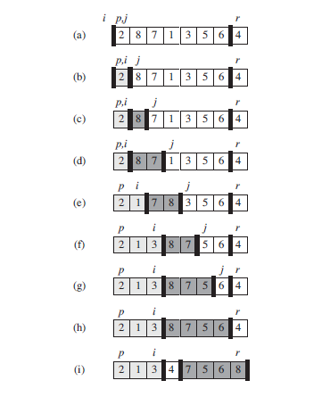
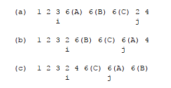

# 基本思想

1. 从需要排序的数组中选取一个基准数；
2. 将数组中所有比基准数小的放在基准数的左边，比基准数大的放在基准数的右边；
3. 对第2步得到的基准数左边和右边的数作为两个分区重复上述步骤。

# 复杂度

快速排序最坏情况下的复杂度为Θ(n<sup>2</sup>)。但是快速排序的平均复杂度是Θ(nlgn)，并且隐藏在此下的常数因子特别小，是一种不稳定排序算法，使用广泛。

注意：只有在partition划分每次都是n-1:0时，快速排序的最坏情况才会出现。只要partition划分为常数项，即使是n-2:1，快速排序的复杂度都是Θ(nlgn)。

# 伪代码及解读

## 伪代码

```
QUICKSORT(A, p, r) //A为待排序数组，p为数组开始排序下标，r为数组结束排序下标
1 if p < r
2   q = PARTITION(A, p, r)
3   QUICKSORT(A, p, q - 1)
4   QUICKSORT(A, q + 1, r)

PARTITION(A, p, r) //A为待排序数组，p和q同上，PARTITION选定A[r]为基准数并完成基本思想中的第二步
1 x = A[r]
2 i = p - 1
3 for j = p to r - 1
4   if A[j] <= x
5       i = i + 1
6       exchange A[i] with A[j]
7 exchange A[i + 1] with A[r]
8 return i + 1
```

<figure>
	
	<figcaption>QuickSort Sample.</figcaption>
</figure>

## 伪代码解读
可以看出，该快速排序伪代码的关键部分就是PARTITION。

1. PARTITION中的第1行选定待排序序列最后一个数作为基准数x。
2. i记录数组左边当前小于或等于基准数的最后一个数的下标，当发现下标为j的数小于等于基准数时，将该数与下标为i+1的数交换后将i加1（i是左边最后一个小于或等于基准数的下标）。循环完成后，易知，基准数在待排序序列中的位置应该是i+1。
3. 一个证明快速排序算法不稳定的例子：

<figure>
	
	<figcaption>Unstable QuickSort Sample. 6(A)、6(B)和6(C)三个数的相对顺序发生变化</figcaption>
</figure>
