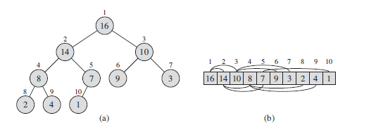
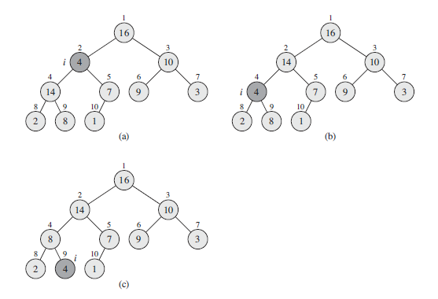
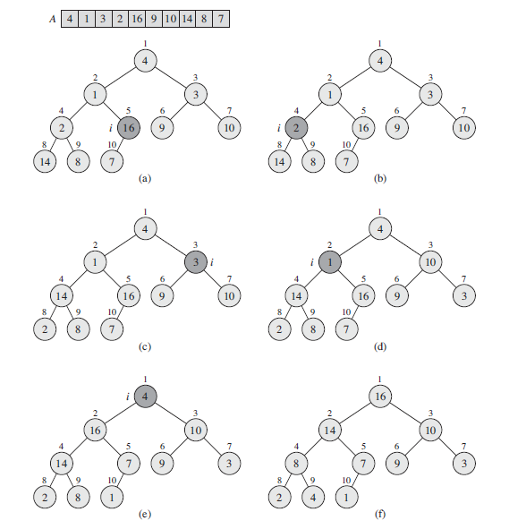
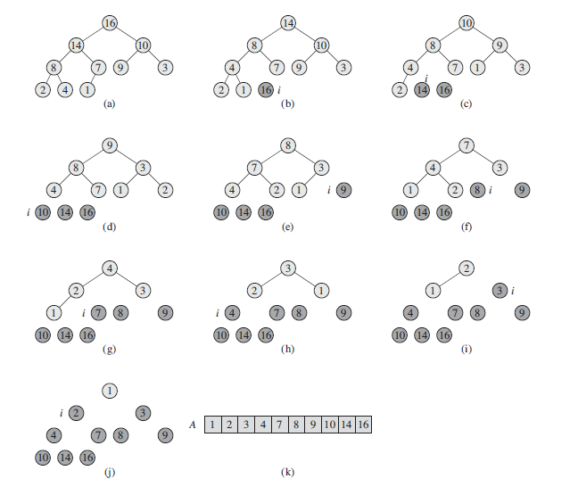

# 堆

**（二叉）堆**是一个数组，可以被看成是一个近似的完全二叉树。树上的每一个结点对应数组中的一个元素。除了最底层外，该树是完全充满的，而且是从左到右填充。表示堆的数组A有两个属性：A.length表示数组的个数，A.heap-size表示数组中目前存储的堆元素个数。

给定一个结点的下标i，可以通过下述伪代码计算得到它的父结点、左孩子和右孩子的下标。

```
PARENT(i)
1 return i/2

LEFT(i)
1 return 2i

RIGHT(i)
1 return 2i + 1
```

<figure>
	
	<figcaption>A max-heap viewed as (a) a binary tree and (b) an array.</figcaption>
</figure>

二叉堆可以分为两种形式：**最大堆**和**最小堆**。

在最大堆中，最大堆性质是指除了根以外的所有结点i都要满足：A[PARENT(i)] >= A[i], 堆中的最大元素存放在根结点中。

在最小堆中，最小堆性质是指除了根以外的所有结点i都要满足：A[PARENT(i)] <= A[i], 堆中的最小元素存放在根结点中。

- `MAX-HEAPIFY`过程：其时间复杂度为O(lgn)，它是维护最大堆性质的关键。
- `BUILD-MAX-HEAP`过程：具有线性时间复杂度，功能是从无序的输入数据数组中构造一个最大堆。
- `HEAPSORT`过程：其时间复杂度为O(nlgn)，功能是对一个数组进行原址排序。
- `MAX-HEAP-INSERT`、`HEAD-EXTRACT-MAX`、`HEAP-INCREASE-KEY`和`HEAP-MAXIMUM`过程：时间复杂度为O(lgn)，功能是利用堆实现一个优先队列。

# 维护一个堆的性质

```
MAX-HEAPIFY(A, i)
1 l = LEFT(i)
2 r = RIGHT(i)
3 if l <= A.heap-size and A[l] > A[i]
4 	largest = l
5 else largest = i
6 if r <= A.heap-size and A[r] > A[largest]
7 	largest = r
8 if largest != i
9	exchange A[i] with A[largest]
10	MAX-HEAPIFY(A, largest)
```

<figure>
	
	<figcaption>The action of MAX-HEAPIFY(A, 2), where A.heap-size = 10.</figcaption>
</figure>

# 建堆

```
BUILD-MAX-HEAP(A)
1 A.heap-size = A.length
2 for i = A.length/2 downto 1
3 	MAX-HEAPIFY(A, i)
```

<figure>
	
	<figcaption>The operation of BUILD-MAX-HEAP, showing the data structure before the call to
MAX-HEAPIFY in line 3 of BUILD-MAX-HEAP.</figcaption>
</figure>

# 堆排序算法

```
HEAPSORT(A)
1 BUILD-MAX-HEAP(A)
2 for i = A.length downto 2
3   exchange A[1] with A[i]
4   A.heap-size = A.heap-size - 1
5   MAX-HEAPIFY(A, 1)
```

<figure>
	
	<figcaption>The operation of HEAPSORT.</figcaption>
</figure>

# 优先队列

**优先队列(Priority queues)**是一种用来维护由一组元素构成的集合S的数据结构，其中的每一个元素都有一个相关的值，称为**关键字(key)**。一个最大优先队列支持一下操作：
- `INSERT(S, x)`： 把元素x插入集合S中。这一操作等价于S = S U {x}。
- `MAXIMUM(S)`： 返回S中具有最大键字的元素。
- `EXTRACT-MAX(S)`： 去掉并返回S中具有最大键字的元素。
- `INCREASE-KEY(S, x, k)`： 将元素x的关键字值增加到k，这里假设k的值不小于x的原关键字值。

```
EXTRACT-MAX(A)
1 if A.heap-size < 1
2   error “heap underflow”
3 max = A[1]
4 A[1] = A[A.heap-size]
5 A.heap-size = A.heap-size - 1
6 MAX-HEAPIFY(A, 1)
7 return max
```

```
HEAP-INCREASE-KEY(A, i, key)
1 if key < A[i]
2   error “new key is smaller than current key”
3 A[i] = key
4 while i > 1 and A[PARENT(i)] < A[i]
5   exchange A[i] with A[PARENT(i)]
6   i = PARENT(i)
```

```
MAX-HEAP-INSERT(A, key)
1 A.heap-size = A.heap-size + 1
2 A[A.heap-size] = -∞
3 HEAP-INCREASE-KEY(A, A.heap-size, key)
```