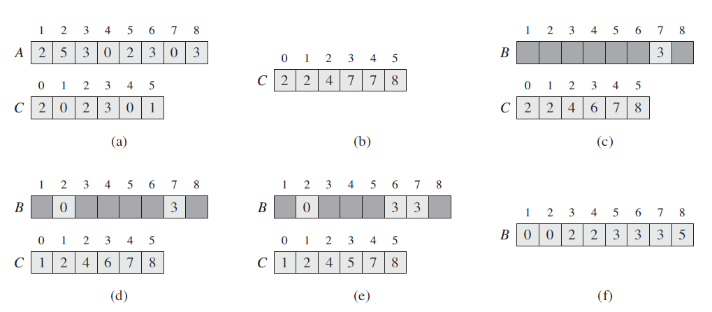

# 摘要
计数排序假设n个输入元素中的每一个都是在0到k区间内的一个整数，其中k为某个整数。当k = O(n)时，排序的运行时间为Θ(n)。

# 基本思想
对每一个输入元素x， 确定小于等于x的元素个数。利用这一信息，就可以直接把x放到他在输出数组中的位置上。

# 伪代码

```
假设输入是数组A[1..n], A.length = n。B[1..n]存放排序的输出，C[0..k]提供一个临时存储空间。
COUNTING-SORT(A, B, k) 
1 letC[0..k] be a new array
2 for i = 0 to k
3     C[i] = 0
4 for j = 1 to A.length
5     C[A[j]] = C[A[j]] + 1
6 // C[i] now contains the number of elements equal to i .
7 for i = 1 to k
8     C[i] = C[i] + C[i - 1]
9 // C[i] now contains the number of elements less than or equal to i .
10 for j = A.length downto 1
11    B[C[A[j]]] = A[j]
12    C[A[j]] = C[A[j]] - 1
```

<figure>
	
	<figcaption>CountingSort Sample.</figcaption>
</figure>

# 总结
计数排序总的时间代价是Θ(n+k)，在实际工作中，当k = O(n)时，我们一般会采用计数排序，这样的运行时间为Θ(n)。

计数排序是一种**稳定**的排序算法。计数排序稳定性的一个重要原因是：计数排序经常会被用作基数排序算法的一个子过程。为了使基数排序正确运行，计数排序必须是稳定的。