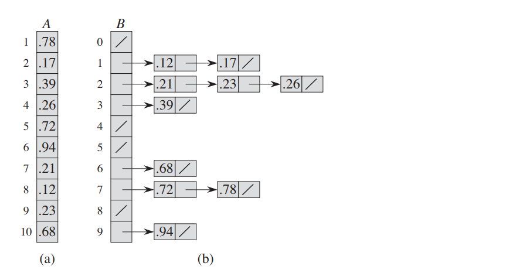

# 摘要
计数排序假设输入数据都属于一个小区间内的整数，而桶排序则假设输入是由一个随机过程产生，该过程将元素均匀、独立地分布在[0, 1)区间上，由于对输入数据做了某种假设，桶排序的速度也很快，平均情况下的时间代价为O(n)。

# 基本思想
桶排序将[0, 1)区间划分为n个相同大小的子区间，或成为桶。然后，将n个输入数分别放到各个桶中。因为输入数据是均匀、独立地分布在[0, 1)区间上，所以一般不会出现很多数落在同一个桶中的情况。为了得到输出结果，我们先对每个桶中的数进行排序，然后遍历每个桶，按照次序把各个桶中的元素列出来即可。

# 伪代码

```
假设输入是数组A[1..n], A.length = n。B[1..n]存放排序的输出，C[0..k]提供一个临时存储空间。
BUCKET-SORT(A)
1 let B[0..n - 1] be a new array
2 n = A.length
3 for i = 0 to n - 1
4   make B[i] an empty list
5 for i = 1 to n
6   insert [i] into list B[inf(nA[i])]
7 for i = 0 to n - 1
8   sort list B[i] with insertion sort
9 concatenate the lists B[0], B[1], ... , B[n - 1] together in order
```

<figure>
	
	<figcaption>Bucket Sort Sample.</figcaption>
</figure>
